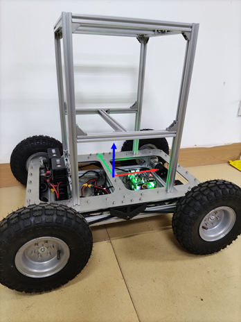

# mick_robot_chasiss

项目文档：https://mickrobot.github.io/ 

注：代码默认的分支master分支适用于四轮差速小车，X4分支为第一版小车代码分支。 M4分支为麦克纳姆轮第一版小车代码分支。

------------------------------------------------------------------------------------------

本项目描述了针对室外环境设计的一个开源ROS小车底盘，项目描述了小车的3D机械图，基于STM32设计的小车控制板，电源板（为传感器供电）；小车的**PCB**、**代码**及**3D图纸**均是开源，大家可以自行下载打样学习。注意：新开源的电源板和控制板仅供大家自己打样学习用，切勿用于商业用途。问题、项目合作可联系 cenruping@vip.qq.com，可以代为调试、新开发线控底盘或针对已有的小车底盘设计**工业版控制器**及**大功率电源模块**。也欢迎加QQ群讨论交流  1149897304 (开源ROS自主导航小车)；

- 小功率电源板-[淘宝链接](https://item.taobao.com/item.htm?spm=2013.1.w4023-18698948782.10.3cd752e6AWcwLT&id=702856225631)

- 大功率电源模块-[淘宝链接](https://item.taobao.com/item.htm?spm=a213gs.success.result.1.5ac34831gMQFX4&id=746778756080)

- 控制板-[淘宝链接](https://item.taobao.com/item.htm?spm=2013.1.w4023-18698948782.7.5ec21803wgmf68&id=649231129557)

------------------------------------------------------------------------------------------

**文件目录说明**

- **ROS_Node**：小车底盘配套的ROS节点，其功能为对外发布小车里程计数据，接收ros cmd_vel话题控制命令控制小车移动，ROS节点与控制板的通讯协议：  https://docs.qq.com/sheet/DV2hmSEdSYVVtclB4 

- **STM32_Code**：存放小车上嵌入式控制板的代码文件，控制器采用STM32F103c8t6，电机采用了大疆M3508电机和C620电调

- **3D_Model_xxx**：存放小车3D模型文件

- **PCB_File**：存放小车上所用PCB文件

- **Reference_Documents**：存放相关的传感器的使用手册等

## 1 更新日志

2023-11-05

- 增加MPU6050 DMP函数，直接读取6050 DMP处理单元输出数据四元数

2022-4-20
- 1、增加了对SBUS控制信号的解码程序，支持SBUS遥控器
- 2、对代码增加了注释

2021-4-18
- 1、开源了小车的电源板和小车控制板
- 2、将DBUS、上位机发送的命令移到中断函数中进行处理
- 3、将PID相关计算函数移到PID.c中
- 4、添加MPU9250 读取和姿态计算函数 

2020-9-8
- 1、更新了DBUS中的函数名称
- 2、更新遥控器信号丢失造成的数据乱码引起“疯转”的问题
- 3、统一4轮和2轮差速小车模型电机控制函数的单位为 m/s  和 rad/s 

 2019-10-07
- 添加ROS节点下发命令清零里程计数据功能

 2020-9-9 
- 更新MickM4 麦克纳姆轮底盘的代码

## 2 差速小车底盘启动
master分支代码文件可适配**两轮**、**四轮差速小车**。两轮差速底盘，主需要把底盘电机ID设置为1和3即可使用4轮差速底盘相同的命令。

###  连线配置小车

```
 git clone https://github.com/RuPingCen/mick_robot_chasiss.git
```

下载代码工程以后，可以根据博客：https://rupingcen.blog.csdn.net/article/details/117257934 去装配小车电机，控制板，设置遥控器。

刷写STM32代码到控制板中，控制板通过CAN总线控制电机，电机采用的是大疆M3508电机和C620电调。

==注：==小车的控制板连线，遥控器操作说明等，可以参考项目主页  https://mickrobot.github.io/ 

### 在ROS中启动小车

**step1:** 将ROS_Node中的mick_bringup目标代码拷贝到ROS工作空间进行编译

```shell
cp -r mick_bringup ~/catkin_ws/src
catkin_make
```

**step2**： 通过USB转232串口线连接电脑和小车控制板，

修改串口权限（可以查看设备的ID号 ls /dev/ttyUSB*）

sudo chmod 766 /dev/ttyUSB0
 或者根据串口设备的标识符去设置串口别名

```
cd mick_bringup/scripts
sudo cp ultrasonic.rules /etc/udev/rules.d/
```

把文件拷贝到/etc/udev/rules.d目录下就可以使用 /dev/mick替代 /dev/ttyUSB0 来访问模块了

**step3:** 启动ROS节点

```shell
roslaunch mick_bringup mickx4_bringup.launch
```

该节点会对外发布、接收以下话题：

- /cmd_vel  ： 接收话题名称，可通过launch文件中 sub_cmdvel_topic 进行修改
- /odom：发布话题名称,可通过launch文件中参数  pub_odom_topic  进行修改

mickx4_bringup  launch文件内容如下：

```xml
  <node pkg="mick_bringup" type="mick_bringup" name="mick_bringup" output="screen">
 	  <param name="sub_cmdvel_topic" value="/cmd_vel" type="str" />
	  <param name="pub_odom_topic" value="/odom" type="str" />
	  <param name="dev" value="/dev/ttyUSB0" type="str" />
	  <param name="baud" value="115200" type="int" />
	  <param name="time_out" value="1000" type="int" />
	  <param name="hz" value="100" type="int" />
	  <param name="is_pub_path" value="0" type="int" /> <!--0: 不发布底盘轨迹  1: 发布 -->
	  <param name="chassis_type" value="0" type="int" /> <!--0: 差速底盘  1: 麦克纳姆轮底盘 -->
  </node>
```

**step4**: 通过键盘遥控小车底盘

这里借助turtlebot3提供的键盘控制节点，检验小车与ROS节点通讯是否正常

注意：需要安装  **sudo apt-get install ros-noetic-turtlebot3-teleop** 包

```shell
export TURTLEBOT3_MODEL=burger
roslaunch turtlebot3_bringup turtlebot3_model.launch
```




## 3 MickM4分支
MickM4分支为麦克纳姆轮ROS底盘的底盘控制程序，代码适用于STM32F103及C620电调

更多的信息可以参考博客地址：https://blog.csdn.net/crp997576280/article/details/102026459

```
 git clone -b MickM4 https://github.com/RuPingCen/mick_robot_chasiss.git
```


## 4 小车控制板-功能说明

### 4.1 小车控制板接口

控制板输入20-36V DC直流，对外提供1路DC 5V 2A 、1路DC 12V 2A 对车载传感器供电。


提供1路DBUS接口、1路232接口、1路CAN总线、1路485接口、1路UART3接口（与485复用）、1路IIC。其中DBUS被用来接收遥航模遥控器的数据，232接口负责与上位机ROS通讯。CAN总线连接4个M3508电机。IIC连接板子上安装的MPU9250。485接口和UART3接口复用，可扩展其他传感器模块。
3路LED指示灯用于显示程序状态。2路按键、4路拨码开关用于调试和选择程序功能。4路隔离输入（输入电压范围12-24V）。4路隔离输出（输出高阻态和GND，承受电流2A）。


### 4.2 小车控制板外形尺寸

板子外形为99*99 mm 安装孔位于四周呈轴对称分布，孔中心间距为93mm,孔直径为φ3.1 mm。如图5所示。


## 5 小车电源板-功能说明
如下图所示，电源板输入20-36V DC直流，输出1路DC 5V 2A 、1路DC 3.3-19V 2A 可调电源 、1路DC 12V 3.5A、1路DC 19V 3.5A，可满足对工控机和自主导航小车车载传感器供电需求。


### 5.1 电源板参数


经过电子负载实际测试，5V和3.3V-19V 采用LM2596S方案,每一路可实现2A的稳定输出，加装散热片以后可实现2.5A长时间输出。
12V 在电子负载实测中可以达到长时间稳定输出3.5A 输出，加装扇热片以后可以实现4A长时间输出，短时可达4.5A。
19V在电子负载实测中可以达到长时间稳定输出3.5A 输出，加装扇热片以后可以实现4A长时间输出，短时可达4.5A，如下图所示。


### 5.2 外形尺寸
板子外形为99*99 mm 安装孔位于四周呈轴对称分布，孔中心间距为93mm,孔直径为φ3.1 mm。如图6所示。

