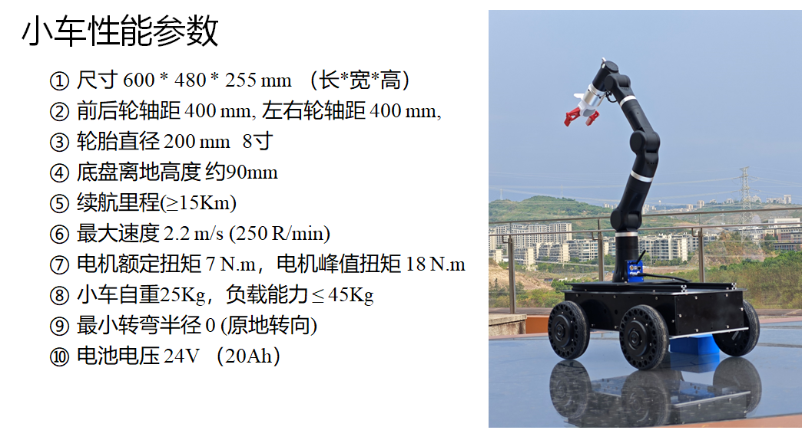

# mick_robot_chasiss

项目文档：https://mickrobot.github.io/ 

本项目描述了针对室外环境设计的一个开源ROS小车底盘，项目开源了小车的3D机械图，基于STM32设计的小车控制板，电源板（为传感器供电）；小车的**PCB**、**代码**及**3D图纸**均是开源，大家可以自行下载打样学习。

- **master分支 为第3版小车 MickX4-V3（ 最新版）**，
- MickX4-V2分支为第2版小车代码分支。 
- M4分支为麦克纳姆轮第一版小车代码分支。[项目更新日志](https://github.com/RuPingCen/mick_robot_chasiss/tree/master/更新日志.md)




**文件目录说明**

- **ROS_Node**：小车底盘配套的ROS节点，其功能为对外发布小车里程计数据，接收ros cmd_vel话题控制命令控制小车移动

- **STM32_Code**：存放小车上嵌入式控制板的代码文件，控制器采用STM32F407

- **3D_Model_xxx**：存放小车3D模型文件

- **PCB_File**：存放小车上所用PCB文件

- **Reference_Documents**：存放相关的传感器的使用手册等

------------------------------------------------------------------------------------------

注意：开源的电源板和控制板仅供大家自己打样学习用，切勿用于商业用途。问题、项目合作可联系 cenruping@vip.qq.com，可以代为调试、新开发线控底盘或针对已有的小车底盘设计**工业版控制器**及**大功率电源模块**。也欢迎加QQ群讨论交流  1149897304 (开源ROS自主导航小车)；

- 小功率电源板-[淘宝链接](https://item.taobao.com/item.htm?spm=2013.1.w4023-18698948782.10.3cd752e6AWcwLT&id=702856225631)
- 大功率电源模块-[淘宝链接](https://item.taobao.com/item.htm?spm=a213gs.success.result.1.5ac34831gMQFX4&id=746778756080)
- 控制板-V1-[淘宝链接](https://item.taobao.com/item.htm?spm=2013.1.w4023-18698948782.7.5ec21803wgmf68&id=649231129557)

------------------------------------------------------------------------------------------


## 1 启动差速小车底盘
master分支代码文件可适配**两轮**、**四轮差速小车**。两轮差速底盘，主需要把底盘电机ID设置为1和3即可使用4轮差速底盘相同的命令。

###  1.1 连线配置小车

==注：==[小车的搭建、连线，遥控器操作说明](https://github.com/RuPingCen/mick_robot_chasiss/tree/master/小车组装说明.md) 

### 1.2 启动小车ROS节点

ROS节点与控制板的通讯协议：  https://docs.qq.com/sheet/DV2hmSEdSYVVtclB4 

小车的配套的ROS节点位于 https://github.com/RuPingCen/mick_robot_chasiss/tree/master/ROS_Node 

该**ROS_Node**目录中包含两个文件夹： **mick_bringup**和**mick_description** ，**mick_bringup**为小车对应的ROS驱动节点，**mick_description**为urdf模型。

**step1:** 将ROS_Node中的mick_bringup目标代码拷贝到ROS工作空间进行编译

```shell
cp -r mick_bringup ~/catkin_ws/src
cd ~/catkin_ws/src
catkin_make
```

**step2**： 通过USB转232串口线连接电脑和小车控制板，

修改串口权限（可以查看设备的ID号 ls /dev/ttyUSB*）

```
sudo chmod 766 /dev/ttyUSB0
```

 或者根据串口设备的标识符去设置串口别名

```
cd mick_bringup/scripts
sudo cp ultrasonic.rules /etc/udev/rules.d/
```

把文件拷贝到/etc/udev/rules.d目录下就可以使用 /dev/mick替代 /dev/ttyUSB0 来访问模块了

**step3:** 启动ROS节点

```shell
roslaunch mick_bringup mickrobot_v3.launch
```

小车节点启动以后可以通过rostopic list命令查看到该ROS节点会对外发布如下Topic


其中：

- /mickrobot/chassis/Imu     对外发布小车自身IMU测量数据
- /mickrobot/chassis/odom  小车里程计数据
- /mickrobot/chassis/odom/path   小车里程计数据对应的路径（默认不发布）
- /mickrobot/rc_remotes/joy  遥控器数据（默认不发布）
- /mickrobot/chassis/cmd_vel    小车控制命令接收话题


mickrobot_v3 launch文件内容如下：

```xml
<launch>
  <node pkg="mick_bringup" type="mickx4_bringup_v3" name="mickrobot" output="screen">

	  <param name="dev" value="/dev/ttyUSB0" type="str" />
	  <param name="baud" value="115200" type="int" />
	  <param name="time_out" value="1000" type="int" />
	  <param name="hz" value="100" type="int" />

	  <param name="chassis_type" value="0" type="int" /> <!--0: 差速底盘  1: 麦克纳姆轮底盘 2:阿卡曼转向  3全向-->

	  <param name="sub_cmdvel_topic" value="chassis/cmd_vel" type="str" />
	  <param name="pub_odom_topic" value="chassis/odom" type="str" />
	  <param name="pub_imu_topic" value="chassis/Imu" type="str" />
	  
	  <param name="is_pub_path" value="1" type="int" /> <!--0: 不发布底盘轨迹  1: 发布 -->
	</node>
</launch>
```

**step4**: 新建终端，通过ROS话题向  **/mickrobot/chassis/cmd_vel** 话题发布数据 控制小车移动（**注意 将遥控器左上角拨码开关拨到最上，表示开启自动驾驶模式**）

```shell
rostopic pub /mickrobot/chassis/cmd_vel -r 10 geometry_msgs/Twist "linear:
  x: 0.0
  y: 0.0
  z: 0.0
angular:
  x: 0.0
  y: 0.0
  z: -0.1" 
```

角速度方向： 逆时针为正，速度方向：车头方向为x方向。


**step5**:  或通过键盘遥控小车底盘（step4和step5选其中一个即可）

这里借助turtlebot3提供的键盘控制节点，检验小车与ROS节点通讯是否正常

注意：需要安装  **sudo apt-get install ros-noetic-turtlebot3-teleop** 包

```shell
export TURTLEBOT3_MODEL=burger
roslaunch turtlebot3_bringup turtlebot3_model.launch
```


## 2 小车控制板

## 2.1 小车控制板V3

第3版小车控制板采用了STM32F407作为主控制器


### 2.2 小车控制板V1

第一版控制板采用STM32F103作为主控制芯片。控制板输入20-36V DC直流，对外提供1路DC 5V 2A 、1路DC 12V 2A 对车载传感器供电。


提供1路DBUS接口、1路232接口、1路CAN总线、1路485接口、1路UART3接口（与485复用）、1路IIC。其中DBUS被用来接收遥航模遥控器的数据，232接口负责与上位机ROS通讯。CAN总线连接4个M3508电机。IIC连接板子上安装的MPU9250。485接口和UART3接口复用，可扩展其他传感器模块。
3路LED指示灯用于显示程序状态。2路按键、4路拨码开关用于调试和选择程序功能。4路隔离输入（输入电压范围12-24V）。4路隔离输出（输出高阻态和GND，承受电流2A）。


### 2.2 小车控制板外形尺寸

第1版和第3版的小车控制板外形和安装孔位一致。

板子外形为99*99 mm 安装孔位于四周呈轴对称分布，孔中心间距为93mm,孔直径为φ3.1 mm。如下图所示。


## 3 小车电源板-功能说明
如下图所示，设计如下电源板以满足对工控机和自主导航小车车载传感器供电需求。

- 输入20-36V DC直流，
- 输出1路DC 5V 2A 
- 输出1路DC 3.3-19V 2A 可调电源 
- 输出1路DC 12V 3.5A
- 输出1路DC 19V 3.5A
  


