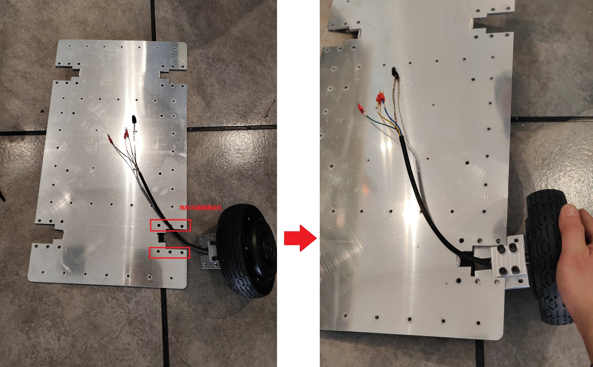
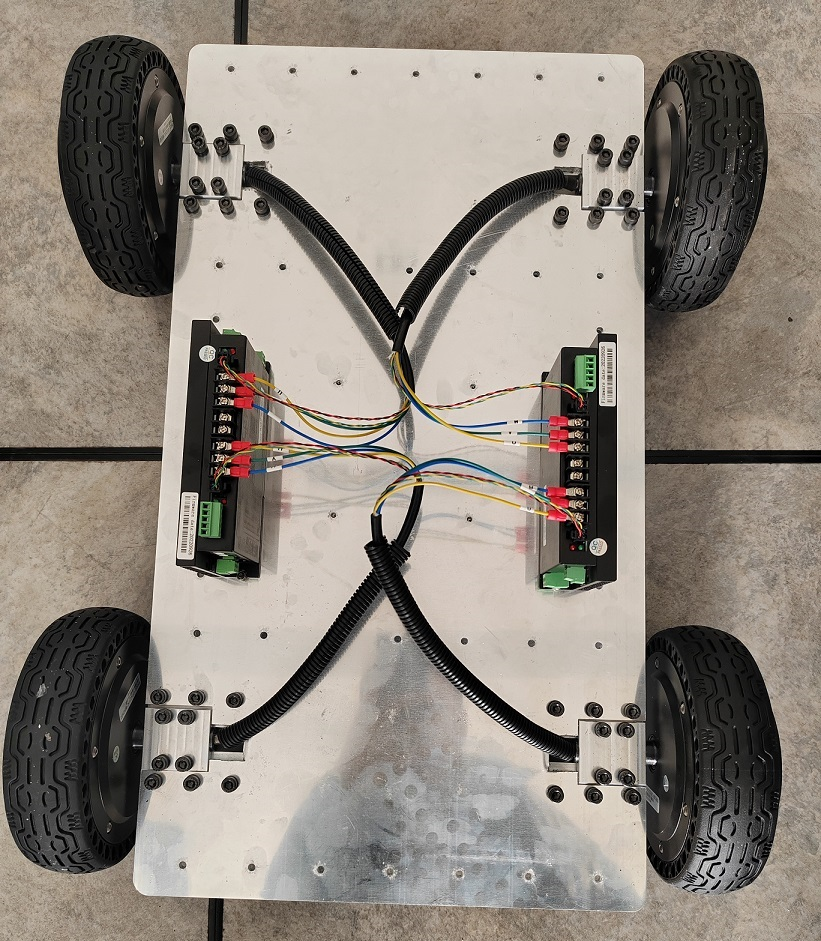
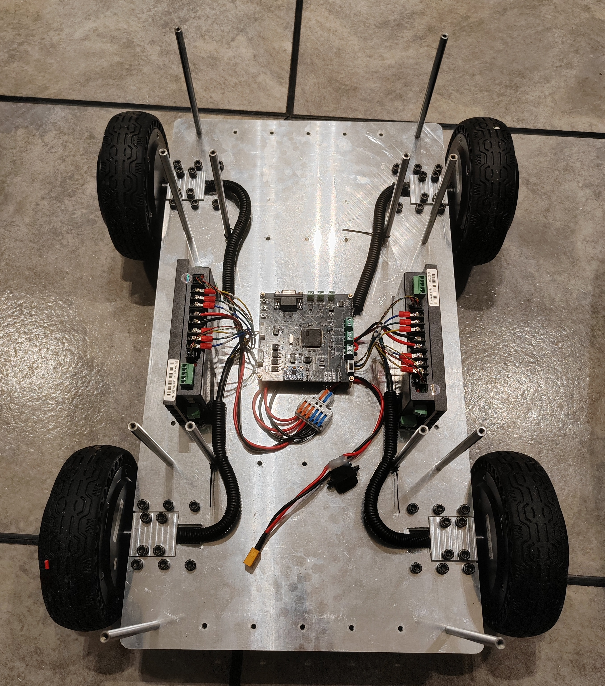
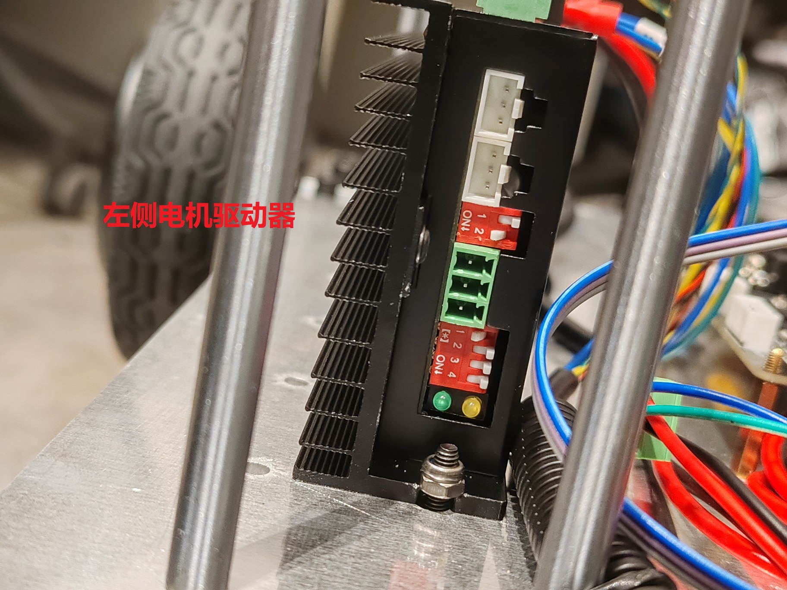
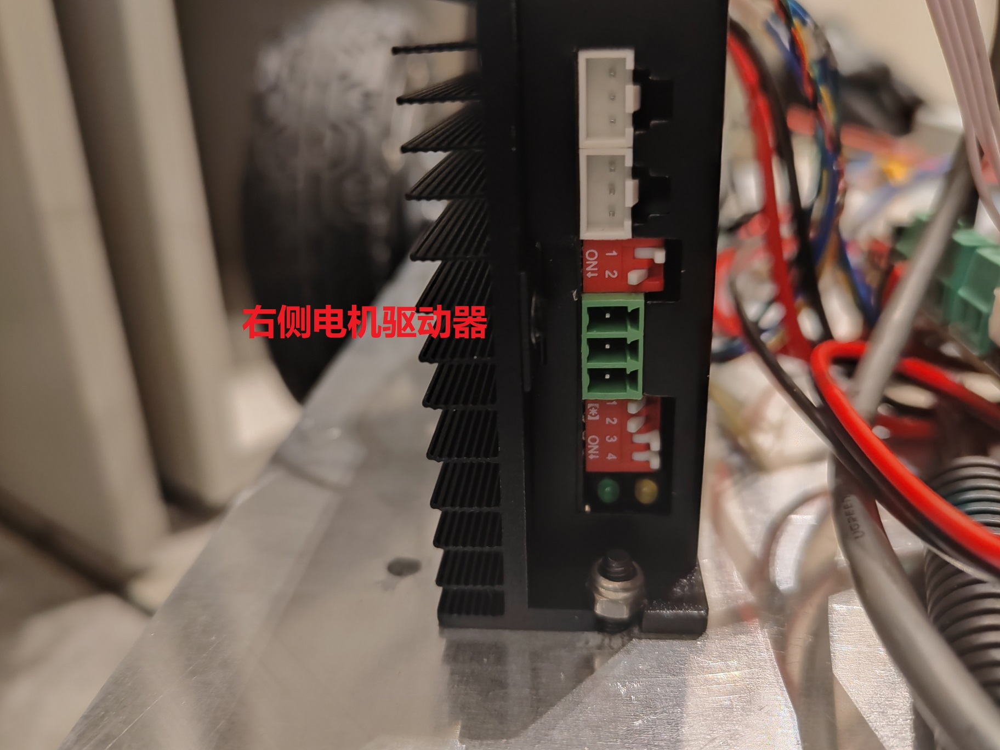
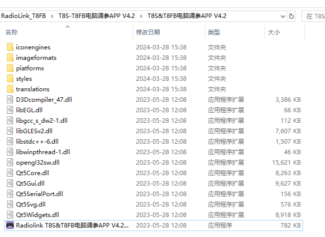
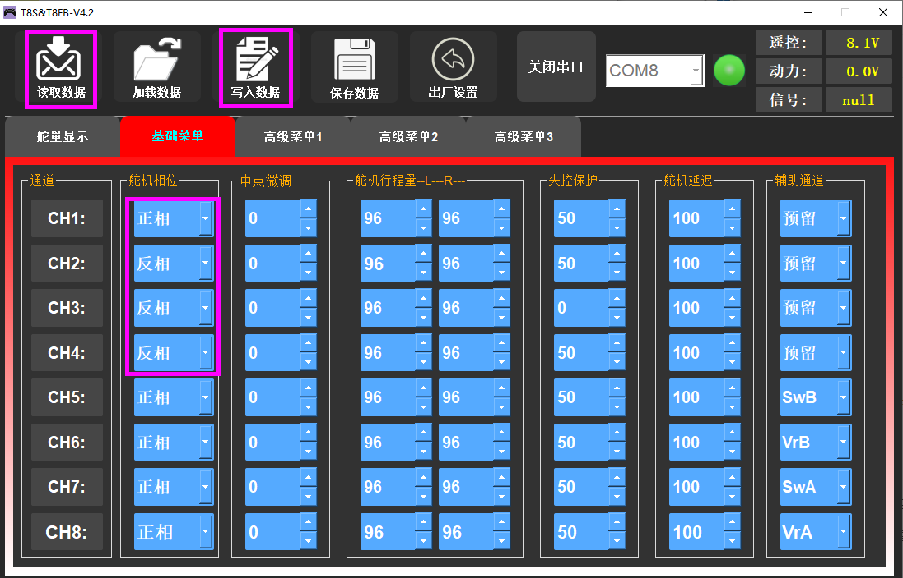
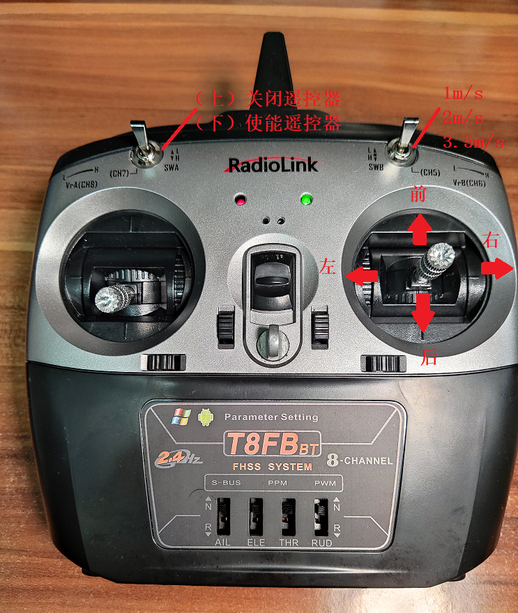
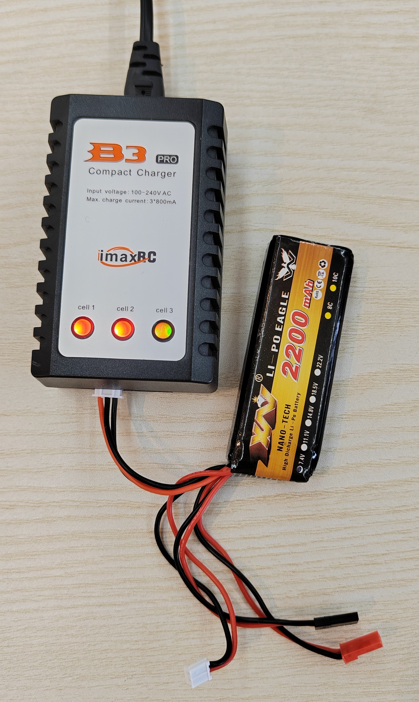
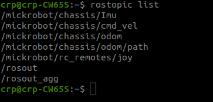

#  小车平台

该小车是一款简易的4轮差速小车，通过4个轮毂电机实现小车差速运动，该小车是mick差速小车的第3版小车，该版本小车简化的小车的机械结构，选用了功率更大的轮毂电机提供动力。

## Mick-V3小车性能指标

|     名称     |         指标          |
| :----------: | :-------------------: |
|     尺寸     |  600 * 450 * 200  mm  |
|  左右轮轴距  |        400 mm         |
|  前后轮轴距  |        400 mm         |
|   轮胎直径   |        170 mm         |
| 最小转弯半径 |           0           |
| 小车最大速度 | 2.2 m/s   (250 R/min) |
| 电机额定扭矩 |         7 N.m         |
| 电机峰值扭矩 |        18 N.m         |
|   负载能力   |         ≤40Kg         |
|   续航里程   |         ≥15KM         |


## 小车组装

### 电机安装
通常情况小车都是安装好以后发货，在进行维修和更换配件以后可能会对小车进行拆装。这里将小车的组装过程进行说明。

小车分上底板、下底板、电机轴卡座\*4、行进电机\*4


如下图所示，将轮毂电机固定支架安装到电机上以后，对齐之间与底板上的6个安装孔，利用配件中的 **M6-16螺丝**固定。按照此方式依次组装好4个电机。



**电机驱动器**固定于下图所示两侧安装孔位置（使用**M4螺丝**）



其中，驱动器散热面朝向外侧，有标注信息的一面朝向内侧。电机上U、V、W接线柱分别与电机线上标号 U（黄）、V（绿）、W（蓝）对应标号相连。

1. 左上角电机连接左侧驱动器1号位置
2. 左下角电机连接左侧驱动器2号位置
3. 右下角电机连接右侧驱动器1号位置
4. 右上角电机连接右侧驱动器2号位置

将底盘控制板通过M3铜柱安装于底盘正中间固定孔上。 



图中支撑杆（8\*100\*M4）的位置可以按上图所示进行固定，或者也可选取其他孔位固定（固定螺丝为M4）。

### 驱动器设置

step1:将小车**车头方向向前**，将左侧电机驱动器

​	**SW2拨码开关BIT2（第2位开关）拨到On处**(起用CAN总线波特率1M),;

​	**SW3拨码1号位置开关全部拨到oN状态**；



step2:将小车车头方向向前，将右侧电机驱动器

**SW2拨码开关BIT2（第2位开关）拨到On处**(起用CAN总线波特率1M),;

**==SW3拨码1号和2号位置开关全部拨到oN状态==**；



step3：将左右两侧驱动器的CAN驱动接口连接起来，并与控制板的CAN1口连接。保证控制板与两个驱动器之间形成串联结构。

## 小车控制板连线

### 与驱动器连线

控制板与电机驱动器通过CAN总线连接，连接时使用控制板CAN1通道，控制板，电机驱动器1和电机驱动器2形成串联形式。

### 与遥控器接收机连线

T8FB遥控器可以适配（R8FM和R8EF两种接收机）

接收机三个引脚（VCC、GND、Tx） 分布对应控制板（VCC、GND、Tx）引脚


##  乐迪T8FB遥控器操控说明

四轮差速小车的控制与mick开源项目中其他小车的操做方法一致。默认采用乐迪T8FB遥控器（SBUS协议）

### 遥控器配置方法

==购买整车时遥控器默认已经配置好，不需要再重新配置。==

当我们自行组装车辆或者更好遥控器时候，可以利用安卓充电线（micro usb）将遥控器与电脑连接，使用（"Reference\RadioLink_T8FB\T8S-T8FB电脑调参APP V4.2\T8S&T8FB电脑调参APP V4.2"）遥控器自带的APP进行配置。




在拿到遥控器的时候要注意将第1通道（右手摇杆竖直方向通道）反向，保证摇杆拉到最下方的时候遥控器输出最小值，最上方输出最大值。同时，对于水平方向通道而言，拉到最左边输出最小值，最右方向输出最大值。（可以使用乐迪官方的参数配置软件进行配置“T8S-T8FB电脑调参APP V4.2”，下图是我修改后的状态。）




### 遥控器操作说明

将控制板第3号位置上的拨码开关拨到==数字侧==，表示SBUS功能。这里我用的时左手油门的RadioLink T8FB遥控器。

1. 遥控器左上角的拨动开关为功能选择按键：置于L档，即最上方位置，表示开启自动驾驶（遥控器操作无效），置于H档表示由遥控器控制小车，忽略上位机命令。
2. 遥控器右上角拨动开关上中下位置分别对应小车1m/s、2m/s、2.2m/s速度。
3. 右手边摇杆竖直方向通道控制小车前后运动（如下图所示），右边的摇杆水平通道控制小车左右旋转。



### 遥控器充电

遥控器电池电压低的时候，会发出 “滴滴~”的声响，此时打开后盖将电池取出。==（注意电池插头的正负方向，对应遥控器背后”+“，”—“标识）==


使用配套充电器充电，电池充满以后充电器的灯由红色变为绿色。遥控器充电时需使用遥控器对应的充电器，遥控器电池为2s电池，电池电压范围（6.4V-8.4V）。




# 小车接口说明

## 2.1 ROS接口

小车的配套的ROS节点位于 https://github.com/RuPingCen/mick_robot_chasiss/tree/master/ROS_Node 

该**ROS_Node**目录中包含两个文件夹： **mick_bringup**和**mick_description** ，**mick_bringup**为小车对应的ROS驱动节点，**mick_description**为urdf模型。


**step1**:   将**ROS_Node**放置于ROS工作空间下进行编译

```shell
cp  -r  ROS_Node ~/catkin_ws/src  #拷贝文件到ROS工作空间
cd ~/catkin_ws/src
catkin_make
```

**step2**:   将小车USB串口连接到电脑，并赋予串口权限

```
sudo chmod 777 /dev/ttyUSB*
```

**step3**： 启动ROS节点

```
 roslaunch mick_bringup mickrobot-v3.launch
```

小车节点启动以后可以通过rostopic list命令查看到该ROS节点会对外发布如下Topic



其中：

- /mickrobot/chassis/Imu     对外发布小车自身IMU测量数据
- /mickrobot/chassis/odom  小车里程计数据
- /mickrobot/chassis/odom/path   小车里程计数据对应的路径（默认不发布）
- /mickrobot/rc_remotes/joy  遥控器数据（默认不发布）
- /mickrobot/chassis/cmd_vel    小车控制命令接收话题


**step4**: 新建终端，通过ROS话题向  **/mickrobot/chassis/cmd_vel** 话题发布数据 控制小车移动（**注意 将遥控器左上角拨码开关拨到最上，表示开启自动驾驶模式**）

```shell
rostopic pub /mickrobot/chassis/cmd_vel -r 10 geometry_msgs/Twist "linear:
  x: 0.0
  y: 0.0
  z: 0.0
angular:
  x: 0.0
  y: 0.0
  z: -0.1" 
```

角速度方向： 逆时针为正，速度方向：车头方向为x方向。


## 小车底盘与ROS节点通讯协议

### 下发接口


### 数据上传协议


# 定位建图算法

autoware环境安装

基于autoware地图构建

基于autoware地图定位

基于autoware自主导航

4G远程驾驶

