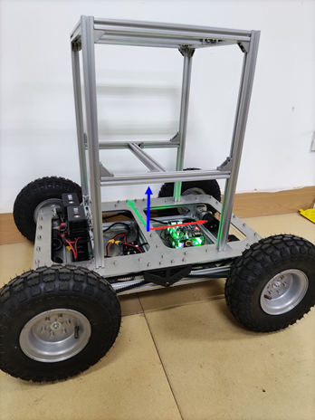

#  更新日志

**2024-6-21**

- 增加了USB通讯功能

- 添加外壳

**2024-3-29**

- 增加了对轮毂电机的支持，增大了小车载重能力（≤40Kg）

- 将主控芯片更换为 STM32F405XX

2023-11-05

- 增加MPU6050 DMP函数，直接读取6050 DMP处理单元输出数据四元数

2022-4-20

- 1、增加了对SBUS控制信号的解码程序，支持SBUS遥控器
- 2、对代码增加了注释

2021-4-18

- 1、开源了小车的电源板和小车控制板
- 2、将DBUS、上位机发送的命令移到中断函数中进行处理
- 3、将PID相关计算函数移到PID.c中
- 4、添加MPU9250 读取和姿态计算函数 

2020-9-8
- 1、更新了DBUS中的函数名称
- 2、更新遥控器信号丢失造成的数据乱码引起“疯转”的问题
- 3、统一4轮和2轮差速小车模型电机控制函数的单位为 m/s  和 rad/s 

 2019-10-07
- 添加ROS节点下发命令清零里程计数据功能

 2020-9-9 
- 更新MickM4 麦克纳姆轮底盘的代码


# 2、历史版本小车

##  2.1MickX4-V2分支

MickX4分支是基于M3508电机设计的底盘，控制主板采用V1.0的主板（STM32F103），注意这个版本的小车底盘负载能力有限。

更多的信息可以参考博客地址：https://blog.csdn.net/crp997576280/article/details/102026459

```
 git clone -b MickX4-V2 https://github.com/RuPingCen/mick_robot_chasiss.git
```




## 2.2 Mick-M4 分支

MickM4分支为麦克纳姆轮ROS底盘的底盘控制程序，代码适用于STM32F103及C620电调

更多的信息可以参考博客地址：https://blog.csdn.net/crp997576280/article/details/102026459

```
 git clone -b MickM4 https://github.com/RuPingCen/mick_robot_chasiss.git
```


